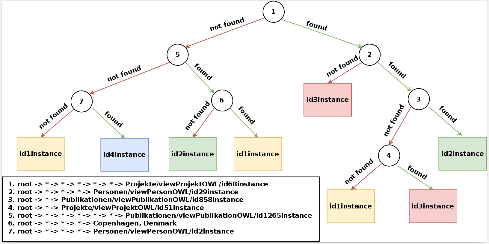

# MINDWALC: Mining Interpretable, Discriminative Walks for Classification of Nodes in a Graph

MINDWALC is an algorithm that efficiently mines for a specific type of walks that maximize information gain. The walks have the following form: a walk of length `l` starts with a root, followed by `l - 2` wildcards (`*`) and then a named entity. An example could be: `root -> * -> * -> * -> Ghent` which would match the walk `Gilles Vandewiele --> studiedAt --> Ghent University --> locatedIn --> Ghent`. For this, root is replaced by the instance which we are classifying. MINDWALC can be combined with three different classification approaches.

## Approach 1: building a decision tree with walks

We can recursively mine walks in order to create a decision tree. An example is displayed below. With this decision tree, we try to classify researchers into one of four research groups ([benchmark dataset AIFB](https://en.wikiversity.org/wiki/AIFB_DataSet)). In the root node, we find the walk `root -> * -> * -> * -> * -> * -> viewProjektOWL/id68instance`. When this walk can be found in the neighborhood of an instance, it can no longer be of the research affiliation `id4instance`, as this leaf does not occur in the subtree on the right. Moreover, this type of walk already demonstrates the added value of having a fixed depth, by the use of wildcards, in our walk. As a matter of fact, we could end up in an entity which is of a Project type in only two hops (e.g. `root -> * -> viewProjektOWL/id68instance`) from an instance in AIFB, but this results in a lot less information gain than when six hops need to be taken. It appears that only two people, who are both from affiliation `id3instance`, are directly involved in the Project `id68instance`, or in other words where this path with only two hops could be matched. On the other hand, it appears that these two people have written quite a large amount of papers with the other researchers in their affiliation. As such, a walk that first hops from a certain person (the root) to one of his or her papers, and going from there to one of the two people mentioned earlier through a `author` predicate can be found for 45 people from affiliation `id3instance`, 3 people from `id2instance` and 2 people from `id1instance`.

 

## Approach 2: building a forest

Alternatively, a forest of trees can be built, where each tree is built from a subset of samples and vertices. This often results in better predictive performances but comes at a cost of a higher runtime and lower predictive performance.

## Approach 3: creating binary feature vectors

Instead of mining walks recursively, we can also perform only a single pass over the data and keep track of K walks maximizing information gain. These walks can then, in turn, be used to create binary feature vectors for training and testing entities. These feature vectors can then be fed to any classification algorithm.

## How can I use MINDWALC for my own dataset?

Dead simple! Our algorithm requires the following input:
* A Knowledge Graph object -- we implemented our own Knowledge Graph object. We provide a function `Graph.rdflib_to_graph` to convert a graph from [rdflib](https://github.com/RDFLib/rdflib).
* A list of train URIs -- our algorithm will extract neighborhoods around these URIs (or nodes in the KG) to extract features from
* A list of corresponding training labels -- should be in same order as the train URIs

For the AIFB dataset, this becomes:
```python3
import rdflib
import pandas as pd
from sklearn.metrics import accuracy_score

from tree_builder import MINDWALCTree, MINDWALCForest, MINDWALCTransform
from datastructures import Graph

g = rdflib.Graph()
g.parse('data/AIFB/aifb.n3', format='n3')

train_data = pd.read_csv('data/AIFB/AIFB_train.tsv', sep='\t')
train_entities = [rdflib.URIRef(x) for x in train_data['person']]
train_labels = train_data['label_affiliation']

test_data = pd.read_csv('data/AIFB/AIFB_test.tsv', sep='\t')
test_entities = [rdflib.URIRef(x) for x in test_data['person']]
test_labels = test_data['label_affiliation']

kg = Graph.rdflib_to_graph(g, label_predicates=label_predicates)

clf = MINDWALCTree()
#clf = MINDWALCForest()
#clf = MINDWALCTransform()

clf.fit(kg, train_entities, train_labels)

preds = clf.predict(kg, test_entities)
print(accuracy_score(test_labels, preds))
```

We provided an example Jupyter notebook as well (`kgptree/Example (AIFB).ipynb`).

## Reproducing paper results

In order to reproduce the results, you will first have to obtain the different datasets. The knowledge graph datasets can be obtained from [here](http://data.dws.informatik.uni-mannheim.de/rmlod/LOD_ML_Datasets/). Afterwards, the script `mindwalc/experiments/benchmark_knowledge_graphs.py` can be run, which will generate pickle files in the `output/` directory for each run. We already populated the `output/` directory with our own measurements. Afterwards, the pickle files can be processed by running `mindwalc/experiments/parse_results.py`

## How to cite

If you use `MINDWALC` for research purposes, we would appreciate citations:
```
@inproceedings{vandewiele2019inducing,
  title={Inducing a decision tree with discriminative paths to classify entities in a knowledge graph},
  author={Vandewiele, Gilles and Steenwinckel, Bram and Ongenae, Femke and De Turck, Filip},
  booktitle={SEPDA2019, the 4th International Workshop on Semantics-Powered Data Mining and Analytics},
  pages={1--6},
  year={2019}
}
```
